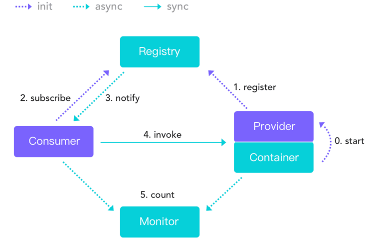

# Qee Cloud Project

Qee Cloud 是自我学习微服务框架编写的分布式框架，目前主要是Rpc框架，之后会慢慢的加入调用链跟踪，分布式事物等。该框架是在学习Dubbo 源码后，对自己的总结，内部的一些思想借鉴了Dubbo了。

## 架构

因为借鉴学习Dubbo,所以架构图直接和Dubbo一致吧。


## 特点

* 基于SPI机制加载各种扩展点，目前根据自己的对Dubbo 的ExtensionLoader 的理解后，自己也相应的实现了。并对其相应进行了修改。
    1) @SPI 标注了扩展点SPI
    2) @Adaptive 为自适应,更改为只能标注在方法上，当方法标注后，但是不存在（通过cloud-adaptive）名查找，不存在则通过ByteBuddy 动态创建。
       3）@AutoWraper为框架自动加载的类，用来对扩展点类进行Wrapper。
    4) @BeanName 提供了按照指定的名字来加载注入属性，找不到在从类型查找注入


* SPI配置文件直接位于类路径下，相关配置示例：（下面的思想配置把Spring-boot的factories文件格式和dubbo做了结合）

```
#自适应，在程序中动态查询
org.qee.cloud.common.annotations.Adaptive=cloud-adaptive:org.qee.cloud.common.extentions.objectfactory.AdaptiveObjectFactory,\
spi:org.qee.cloud.common.extentions.objectfactory.SpiObjectFactory

#程序框架必定要加载的
org.qee.cloud.common.annotations.AutoWraper=org.qee.cloud.common.extentions.objectfactory.TimeWatchedObjectFactory

```

* 向Dubbo学习，所以该框架也是基于接口的RPC框架
* 向Dubbo学习，也会实现相应的负载均衡
* 向Dubbo学习，服务自动发现和注册也是少不了的
* 运行时标签路由
* Dubbo 具有可视化，应该也会相应实现，但是对该项目不是重要，所以之后陆续看情况
* 提供spring-boot-starter

## 查看点

1、@CloudReference 类比 @DubboReference 为了实现DubboReference的所有功能，但是参数功能又非常的多。目前实现一些主要内容

1) 实现远程服务的引用 2）把CloudReference代理的对象让Spring容器关联，即可以getBean拿到

2、@CloudService 类比 @DubboService 1）实现类似 spring @Service 的 功能， 2）注册服务到注册中心

## 使用手册
 
